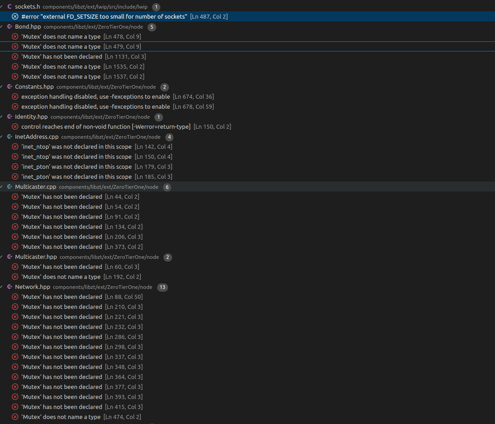

# Zerotier-Espressif
Zerotier on embedded devices for Espressif(like ESP8266/ESP32)

## Under development USE WITH CAUTION!

# Install ESP-IDF framework
 Follow [ESP-IDF installation guide](https://docs.espressif.com/projects/esp-idf/en/latest/esp32/get-started/index.html#installation)

## build

```bash
git clone https://github.com/zhzhzhy/Zerotier-Espressif
cd Zerotier-Espressif
get_idf
idf.py builld
```
OR

use [VScode extension](https://github.com/espressif/vscode-esp-idf-extension/blob/master/docs/tutorial/install.md) 
After installation click **ESP-IDF Build project** Button

## Known Errors

After ESP-IDF component build complete,libzt is the last component being built.
The compiler says 'Mutex' does not name a type ‘(Maybe The thread lock in FreeRTOS is't compatible with libzt itself)

